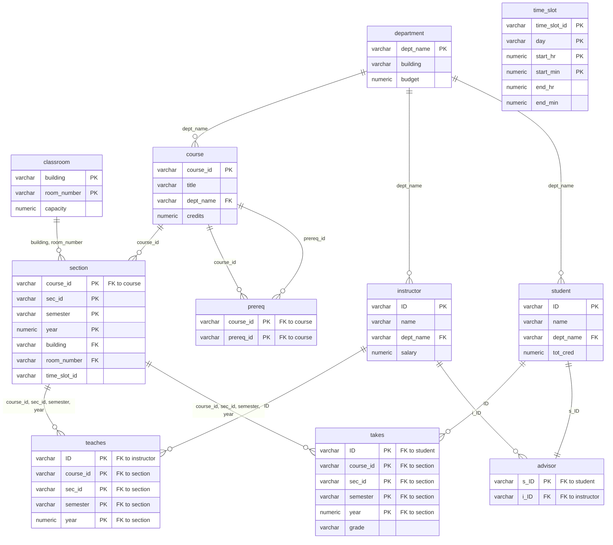

# JPA ERD - University Database

JPA(Jakarta Persistence API)를 활용하여 대학교 데이터베이스의 ERD를 엔티티로 매핑하고, 다양한 조회 기능을 구현한 프로젝트입니다.

## 기술 스택

| 기술 | 버전 | 설명 |
|------|------|------|
| **JPA (Jakarta Persistence API)** | - | ORM 표준 인터페이스. 엔티티 매핑, JPQL 쿼리, EntityManager를 통한 영속성 관리 |
| **Hibernate** | 6.2.33.Final | JPA 구현체. 지연 로딩(Lazy Loading), 복합키(@IdClass) 매핑 처리 |
| **MySQL** | - | 데이터 저장소. MySQL Connector/J 8.4.0 사용 |
| **Lombok** | 1.18.30 | `@Getter`, `@Builder`, `@AllArgsConstructor` 등으로 보일러플레이트 코드 제거 |
| **JUnit 5** | 5.13.4 | 단위 테스트 프레임워크 |
| **Maven** | - | 빌드 및 의존성 관리 |

## 프로젝트 구조

```
src/main/java/dev/university/
├── entity/       # JPA 엔티티 (DB 테이블 매핑)
├── dao/          # Data Access Object (JPQL 쿼리)
├── dto/          # Data Transfer Object (응답 데이터 변환)
├── service/      # 비즈니스 로직
├── controller/   # 컨트롤러
└── App.java      # 메인 실행 클래스
```

## ERD 엔티티 관계
공개 데이터셋인 University Database를 사용하였습니다
(출처 : https://www.db-book.com/university-lab-dir/sample_tables-dir/index.html )



### 주요 JPA 매핑 기술

- **복합키 매핑 (`@IdClass`)**: `Section`, `Takes`, `Teaches`, `Classroom` 엔티티에 적용. `SectionId`, `TakeId`, `TeachesId`, `ClassroomID` 클래스를 별도 정의하여 복합 기본키를 구현
- **PK이면서 FK인 컬럼 매핑**: `Section.course` 필드에 `@Id`와 `@ManyToOne`을 동시에 적용하여, 복합키의 일부가 외래키인 경우를 처리
- **지연 로딩 (Lazy Loading)**: `@ManyToOne(fetch = FetchType.LAZY)`를 적용하여 연관 엔티티 로딩을 지연시키고, 실제 접근 시점에 쿼리 실행
- **양방향 연관관계**: `Section ↔ Takes` 관계에서 `@OneToMany(mappedBy = "section")`으로 양방향 매핑 구현

---

## 서비스별 기능 설명

### 1. SectionService — 분반별 수강 학생 조회

> 특정 Section(분반)에 등록된 학생 목록을 조회하는 서비스

#### 제공 기능

| 메서드 | 설명 |
|--------|------|
| `findSectionWithStudents(courseId, secId, semester, year)` | 복합키로 특정 Section을 조회하고, 해당 분반의 수강 학생 목록을 반환 |
| `findAllSectionsWithStudents()` | 전체 Section 목록과 각 분반의 수강 학생을 일괄 조회 |

#### 동작 방식 — DTO 호출 체인

```
SectionService
  └─ EntityManager.find(Section.class, SectionId) — 복합키로 Section 엔티티 조회
       └─ SectionDTO.from(section) — 정적 팩터리 메서드로 변환
            └─ section.getTakes() — 양방향 관계를 통해 Takes 목록 Lazy Loading
                 └─ Takes::getStudent — 각 수강 기록에서 Student 엔티티 접근
                      └─ StudentDTO.from(student) — Student → StudentDTO 변환
```

1. `SectionService`가 `EntityManagerFactory`를 직접 관리하며, 메서드 호출마다 새로운 `EntityManager`를 생성
2. 복합키(`SectionId`)를 사용하여 `em.find()`로 Section 엔티티를 조회
3. `SectionDTO.from()` 정적 팩터리 메서드 내에서 **DTO 호출 체인**이 실행됨:
   - `Section.getTakes()`로 양방향 `@OneToMany` 관계를 통해 `Takes` 목록을 Lazy Loading
   - 각 `Takes`에서 `getStudent()`로 `Student` 엔티티에 접근
   - `StudentDTO.from()`으로 최종 DTO 변환
4. 영속성 컨텍스트가 열려 있는 동안 Lazy Loading이 수행되므로, `em.close()` 전에 모든 DTO 변환을 완료

---

### 2. ClassroomService — 강의실별 개설 강의 조회

> 특정 건물/호실에서 열리는 모든 강의(Section) 목록을 조회하는 서비스

#### 제공 기능

| 메서드 | 설명 |
|--------|------|
| `getSectionsByClassroom(building, roomNumber)` | 건물명과 호실번호로 해당 강의실의 개설 강의 목록을 반환 |

#### 동작 방식

```
ClassroomService
  └─ ClassroomDAO.findSectionsByClassroom(building, roomNumber)
       └─ JPQL: "SELECT s FROM Section s WHERE s.building = :building AND s.roomNumber = :roomNumber"
            └─ Section → ClassroomDTO 수동 매핑 (Stream API)
```

1. `ClassroomDAO`가 `EntityManagerFactory`를 `static final`로 관리
2. JPQL `WHERE` 절로 building, roomNumber 조건에 맞는 Section 목록을 조회
3. 조회된 Section 엔티티를 Java Stream API의 `map()`으로 `ClassroomDTO`에 수동 매핑

---

### 3. CourseService — 학과별 과목 조회

> 특정 학과(Department)에 소속된 과목(Course) 목록을 조회하는 서비스

#### 제공 기능

| 메서드 | 설명 |
|--------|------|
| `getCoursesByDepartment(deptName)` | 학과명으로 해당 학과의 과목 목록을 정렬하여 반환 |

#### 동작 방식

```
CourseService
  └─ CourseDAO.findByDepartmentName(deptName)
       └─ JPQL: "SELECT c FROM Course c WHERE c.department.deptName = :deptName ORDER BY c.courseId"
```

1. `CourseDAO`는 외부에서 `EntityManager`를 주입받는 방식 (생성자 주입)
2. JPQL에서 `c.department.deptName`으로 **연관 엔티티의 필드를 직접 탐색** (묵시적 조인)
3. `Course` 엔티티를 DTO 변환 없이 그대로 반환

---

### 4. InstructorService — 교수 주간 스케줄 조회

> 특정 교수의 학기별 강의 스케줄(담당 과목, 강의 장소)을 조회하는 서비스

#### 제공 기능

| 메서드 | 설명 |
|--------|------|
| `getInstructorSchedule(instructorId, year, semester)` | 교수 ID, 연도, 학기를 기준으로 강의 스케줄을 반환 |

#### 동작 방식

```
InstructorService
  └─ 1. InstructorDao.findWeeklySchedule(instructorId, year, semester)
       └─ JPQL: SELECT t FROM Teaches t 
                JOIN FETCH t.instructor i JOIN FETCH t.section s
                WHERE i.id = :id AND t.year = :year AND t.semester = :semester
  └─ 2. List<Teaches> 엔티티 결과를 Stream을 사용하여 InstructorScheduleDto로 변환
```

1. `InstructorDao`는 외부에서 `EntityManager`를 주입받는 방식
2. **JPQL FETCH JOIN**을 사용하여 Teaches, Instructor, Section 엔티티를 한 번의 쿼리로 조회
3. Service 레이어에서 Entity를 DTO로 변환하여 반환

---

## 테스트

모든 테스트는 JUnit 5 기반이며, 실제 MySQL DB에 연결하여 통합 테스트로 실행됩니다.

### SectionServiceTest

| 테스트 | 설명 |
|--------|------|
| `testFindStudentsByCS101Fall2017` | CS-101 / 1 / Fall / 2017 분반의 수강 학생 6명 조회 검증 |
| `testFindStudentsByCS190Spring2017` | CS-190 / 2 / Spring / 2017 분반의 수강 학생 2명 조회 검증 |
| `testFindStudentsByBIO101Summer2017` | BIO-101 / 1 / Summer / 2017 분반의 수강 학생 1명(Tanaka) 조회 검증 |
| `testFindStudentsByInvalidSection` | 존재하지 않는 Section 조회 시 `null` 반환 검증 |
| `testFindAllSectionsWithStudents` | 전체 15개 Section에 대해 학생 목록 일괄 조회 검증 |

### ClassroomServiceTest

| 테스트 | 설명 |
|--------|------|
| `testFindSectionsByPackard101` | Packard 101 강의실의 개설 강의 4건 조회 및 building/roomNumber 필터 검증 |
| `testFindSectionsByInvalidClassroom` | 존재하지 않는 강의실(Packard 999) 조회 시 빈 리스트 반환 검증 |

### CourseServiceTest

| 테스트 | 설명 |
|--------|------|
| `testFindCoursesByCompSciDepartment` | Comp. Sci. 학과의 과목 5건 조회 및 courseId 순서(CS-101~CS-347) 검증 |
| `testFindCoursesByPhysicsDepartment` | Physics 학과의 과목 1건(PHY-101, Physical Principles) 조회 검증 |
| `testFindCoursesByInvalidDepartment` | 존재하지 않는 학과(Korean) 조회 시 빈 리스트 반환 검증 |
| `testFindDepartment` | Department 엔티티 직접 조회(Comp. Sci. → Taylor 건물) 검증 |

### InstructorTest

| 테스트 | 설명 |
|--------|------|
| `instructorScheduleFullInfoTest` | Srinivasan 교수(10101)의 2017년 Fall 학기 강의 스케줄 2건 조회 검증 |
